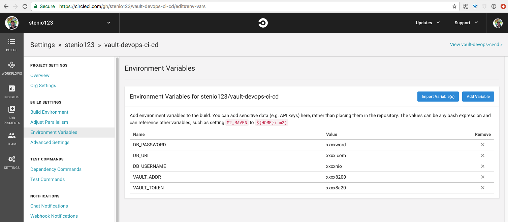
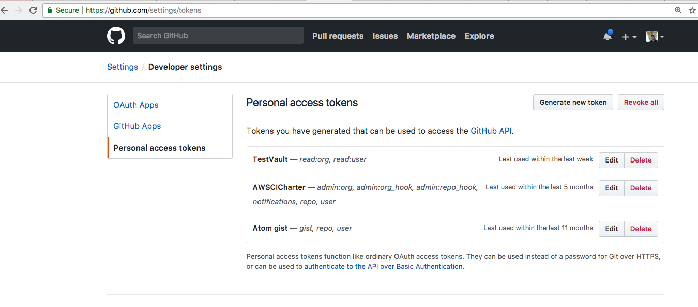
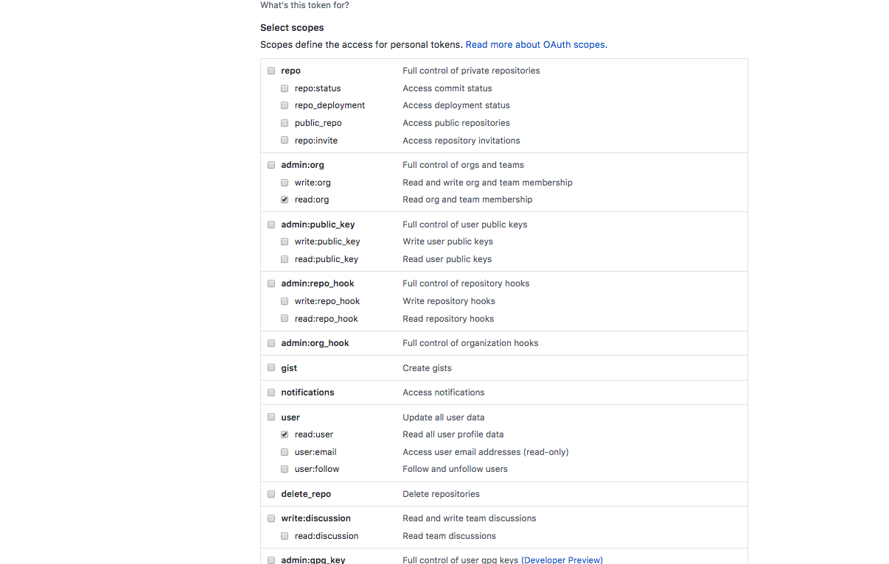

# Vault Management CI/CD Workflow


Vault is an open source secrets management solution, more information can be found here <Link to Vaultproject.io>

This repository is inspired by the blog post ["Codifying Vault Policies and Configuration"][post], where Seth Vargo suggests an approach for codifying Vault resources. Our aim for this repository is to take that idea one step further and provide a reference implementation of how Vault configuration can be managed as part of a CI/CD workflow by members of a security team. 

This repository uses curl to communicate with Vault, and CircleCI as the suggested CI/CD tool, however it can easily be adapted to one of the other supported API Libraries <link here> or other CI/CD providers.

## Assumptions
- You have a Vault server running and unsealed
- You have a Postgres database running
- There are firewall rules in place to allow Circle CI or your preferred CI/CD solution to communicate with Vault and Postgres
- This reference is meant as an example. In a production setting you should restrict access to Vault and to your DB by running the CI/CD from your hosted infrastructure.

---

## Workflow
```

       +-----------+     +-----------+
       |           |     |           |
       | Provision |     |   Test    |
  +--> |           +---> |           +----+
  |    |           |     |           |    |
  |    +-----------+     +-----------+    |
  |                                       |
  |          +--------------+             |
  |          |              |             |
  |          |   Update     |             |
  +----------+   Vault      | <-----------+
             |   Resources  |
             |              |
             +--------------+
```

### Provision
- Follows Vault path hierarchy
- Check API docs for instructions on adding new paths <Link here>

### Test
- Validates provisioning has been successful by querying rest API
- 1-to-1 relationship with provisioning resources for complete code coverage
- Serves as documentation and validation
- Idempotent (can be executed multiple times without impacting already existing resources)

### Update Vault Resources
Working with different teams:
- Create secret paths, associated policies and tie these to users
- Distribute the user credentials, teams are responsible for seeding Vault and managing their secrets

### Responsibilities
The vision for this repository is that a Security team will be responsible for managing Vault configuration, using this code to track the state of Vault.

Secrets will be the responsibility of each individual team. For example, if team responsible for app1 wants to use Vault, it files a request with the Security team, which creates the following:
- An admin policy for a secret path (For example secret/app1/*)
- Read only policies for this path, associated with the different environments (For example secret/app1/dev/*)
- Secret stubs for the above paths
- An authentication method associated with the created policies

It is then team app1 responsibility to enter and track its secrets, and to coordinate with the Security team on how to credentials to use Vault services. This code has examples using userpass, github and LDAP auth methods

---

## Configure Circle CI
- Clone this code and push to your own repository in Github
- Go to https://circleci.com/ and login or create a new account
- Allow Circle CI to access your Github account
- Click on "Add projects", select your repository where you pushed the cloned code
- You only need to specify "Operating System" and  "Language" if you plan to change the way the code is executed. For now simply scroll down and click "Start Building
- The build will fail. Click on the gear icon to the right, to go to project settings.
- In the project settings, go to "environment variables", and set the values to the following:
    - VAULT_ADDR (Address to the vault server, in the format http://address:port or https://address:port)
    - VAULT_TOKEN (Vault token with permissions to execute provision and test commands)
    - DB_USERNAME (Username in Postgres database with permissions to run SQL query specified in database/roles)
    - DB_PASSWORD (Password for that username)
    - DB_URL (URL for database, that will be interpolated in the connection string. Example: mydb.olt6t13fa.us-east-2.rds.amazonaws.com)
    
- Trigger the run again, which should now succeed
- Now every time you push to Github, the CICD will trigger executing provisioning followed by tests.
- You can go to Gihub > Your project > Settings > Webhooks and customize the automated CICD trigger behaviour as needed
- You can update the Circle CI badge on the README by going to Circle CI > Project > Notifications> Badges

## Local development and testing
As you make changes to this codebase, you might want to test locally before pushing to github and trigering the CICD run. Assuming your machine has permission to connect to both the Vault server and the Postgres database:
- Update environment variables on env.local.example 
- rename env.local.example to env.local

---

## Authentication Methods
The files under data/auth/github and data/auth/ldap are meant as reference only, and should be updated to your organization's needs.

### Github
- Update your organization name on data/auth/github/config.json
- If you want to specify Vault policies per Github team in your organization, update data/auth/github/map/teams and associated policy accordingly
- If you want to specify Vault policies per Github user in your organization, update data/auth/github/map/users and associated policy accordingly. Note that these Vault policies will be applied *in addition* to Vault policies applied to a Github team this user is a member of
- In order for an user to login using Github auth method:
    - The user should generate a personal token in Github:
        - Go to Github > Your profile > Settings > Developer settings > Personal access tokens > Generate
        
        - When selecting the scope for this token, it should have at least "read:org, read:user" privileges
        
    - The user should write this token in a file @token.json, for example
    ```
    {
    "token": "4db...05"
    }
    ```
    - The user then executes the command
    ```
        curl  --request POST --data @token.json $VAULT_ADDR/v1/auth/github/login
    ```
- Additional information in the ["Github auth method documentation"][github-docs]

### LDAP
- Update data/auth/ldap/config.json with your organization's LDAP server information
- Update data/auth/ldap//groups to associate Vault policies with specific groups in your LDAP server
- Additional information in the ["LDAP auth method documentation"][ldap-docs]

---

## A Note on Idempotency
Whenever a value is written in Vault, it overwrites the pre-existing value. For this reference implementation we want to allow idempotent operation of the scripts (they can be executed multiple times having same result), so they can be executed as part of the CICD, while at the same time allowing the proposed workflow of having the security team define placeholder stubs and handing the responsibility to manage secrets to each application team.  

This balance is achieved in provision.sh, which has the function "new_value" that should be called for values that shouldn't be overwritten during CICD execution. Examples include username users, which their associated passwords, and any secrets.

If you want to test it out, run provision.sh, then update a secret manually and run provision.sh again. You will see that the secret value hasn't changed.


[post]: https://www.hashicorp.com/blog/codifying-vault-policies-and-configuration.html
[vaultproject]: https://www.vaultproject.io
[github-docs]: https://www.vaultproject.io/docs/auth/github.html
[ldap-docs]: https://www.vaultproject.io/docs/auth/ldap.html
